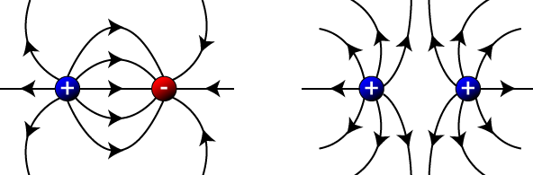

```{r setup, include=FALSE}
knitr::opts_chunk$set(message=FALSE,warning=FALSE, cache=TRUE)
```

O primeiro passo para entender do que se trata os Campos Elétricos, iremos definir alguns conceitos fundamentais.

# Cargas elétricas 
(Considerando cargas elétricas pontuais)

<a href = "https://images.app.goo.gl/LefCnAhMtHgMZVHCA">

</a>

**O que é uma carga pontual?** 
**Uma carga pontual gera campo elétrico?** 
**O que difere uma carga elétrica positiva de uma carga elétrica negativa?** 

Define-se carga elétrica pontual sendo um corpo eletrizado cujas dimensões são desprezíveis se comparadas às distâncias que o separam de outros corpos eletrizados.

O campo elétrico de uma carga pontual terá direção radial, ou seja, como se a carga estivesse localizada no centro de um círculo de raio “r”.


## Natureza das cargas elétricas

Cargas elétricas podem apresentar natureza positiva ou negativa.

Uma das principais diferenças entre as cargas positivas e negativas são as linhas de  campos geradas por essas cargas uma vez que o sentido de F é para longe da carga pontual q se ela for positiva e na direção da carga pontual se q for negativa.

Observe a imagem a seguir para visualizar o campo elétrico gerado por cada uma dessas cargas.


<a href = "https://images.app.goo.gl/vLDS4zFsL2SkEqMA6">

</a>

## Como determinar um campo elétrico?
(a partir dessas cargas pontuais)

Para determinar o campo elétrico produzido por uma distância r de uma carga pontual q, colocamos uma carga de prova qo nesse ponto.

De acordo com a **Lei de Coulomb**, o módulo da força eletrostática que age sobre qo é dado por:

<center> Definindo a Lei de Coulumb:  </center>
$$
\vec{F_e}=k_{e}{\frac {qq_{0}}{r^{2}}}\hat{\mathbf r}
$$

<center> Constante de Permissividade Elétrica: </center>
$$
k_e = \frac{1}{{4\pi  \varepsilon _0 }} \\
$$

<center> $k_e$ ≈ 8.988 x $10^9 N {m^2}/{C^2}$ </center>


# Campo  elétrico

**O que é um campo elétrico?** 
**Qual é o limite de um campo elétrico?** 

Cargas elétricas modificam as propriedades elétricas do espaço à sua volta, causando um campo elétrico. Esse campo elétrico desempenha a função de transmissor das interações entre cargas elétricas, podendo ser de afastamento ou de aproximação, de acordo com o sinal da carga que o produziu, sendo ele uma grandeza vetorial que depende do ponto no espaço em que ela se encontra.


## Fórmula Matemática
**Como calcular matemáticamento um campo elétrico?** 

A expressão abaixo nos permite calcular a intensidade do campo elétrico, quaisquer que sejam as cargas que criam esse campo.

<center> Definindo Campo Elétrico a partir de Força Elétrica:  </center>
$$
{\vec{E_i}}= \frac{\vec{F_e}} {q_0}
$$

Para encontrarmos o módulo do vetor campo elétrico de uma carga pontual é dado por:

$$
{\vec{E_i}}= \frac{\vec{F_e}} {q_0} = \frac{1}{q_0} \frac{1}{4\pi\varepsilon_0} \frac{qq_{0}}{r^{2}} \hat{\mathbf r} = \frac{1}{{4\pi\varepsilon _0}} \frac{q}{r^{2}} \hat{\mathbf r}
$$

$$
{\vec{E_i}}=  \frac{1}{{4\pi\varepsilon _0}} \frac{q}{r^{2}} \hat{\mathbf r}
$$

## Simulação

Na simulação abaixo é possível adicionar cargas positivas (vermelhas) e negativas (azuis) e verificar o comportamento dos campos elétricos gerados por elas. Aplicando um sensor (ponto amarelo), é possível visualizar o vetor diretor desse campo em vários pontos da tela, conforme reposicionar o curso. Ainda é possível verificar o potencial desse campo e a distância entre as cargas, posicionando os equipamentos localizados na parte direta inferior.

Que tal adicionar uma carga positiva e uma negativa? Esse cenário cria um dipolo elétrico!


<iframe src="https://phet.colorado.edu/sims/html/charges-and-fields/latest/charges-and-fields_pt_BR.html" width="800" height="400" scrolling="no" allowfullscreen></iframe>


# Campo elétrico Total

**Como o campo elétrico gerado por uma carga pontual interfere no campo elétrico gerado por uma outra carga pontual?** 
**Qual será relação da natureza das cargas nesse sentido?** 

O sentido do campo elétrico é o mesmo que o da força que age sobre a carga, ou seja, cargas de mesma natureza ou mesmo sinal quando estão próximas tem um comportamento de repulsão entre si. Já cargas de sinais opostos estão próximas sua tendência é se aproximar ainda mais, logo o sentido do campo elétrico será para longe da carga pontual positiva e na direção da carga pontual negativa.


<a href = "https://i.stack.imgur.com/JxCq5.png">

</a>

<a href = "https://images.app.goo.gl/tnWtBjpfYN3Axf666">

</a>


# Visualizar gráfico do campo elétrico


<iframe src="https://trinket.io/embed/glowscript/0924a7e482" width="100%" height="356" frameborder="0" marginwidth="0" marginheight="0" allowfullscreen></iframe>


